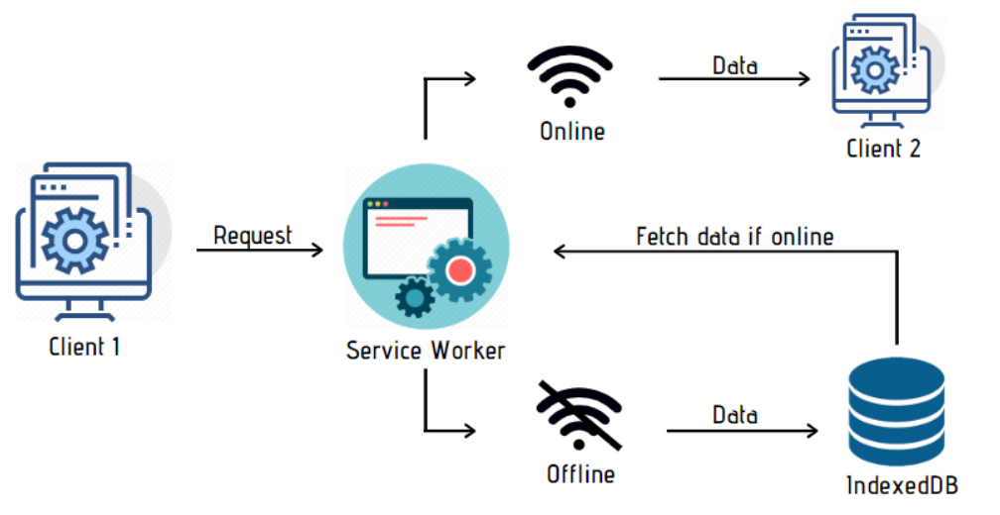

# PWA

PWA is a pure web standalone application that provides fallback scenarios in absence of network.
PWA brings the native APP and web APP together. Is pure web, meaning it targets the browser and is a combination of javascript, html, css without any SDK.There is no need to a publish PWA since it's a website it's easy to deploy and update.
From Native Universe we bring to the PWA platform, Offline access, standalone application that is installable.

## Components

There are three main components in a PWA

- Web App

- Web App Manifest, is the heart of PWA, two manifests two PWA
- Service Worker

Light house an open source tool maintained by chrome which is available as a CLI and within Devtool. It tests the website against PWA criteria, each browser has a criteria that may change by time.

We are going to analyze three ways to run javascript code in background.

## Background Synchronization API

Background sync is most commonly used for resending data to a server when a previous request has failed. Web Applications do that by deferring server synchronization work to their service worker to handle at a later time, if the device is offline.

Background sync API does not require a PWA. Sync will happen even if the Web App is not running on the browser.

### Background Sync Architecture



## Periodic Background Synchronization API

Periodic background sync lets you show fresh content when a progressive web app or service worker-backed page is launched. It does this by downloading data in the background when the app or page is not being used.
PWA ask permission to run code periodically, in Chrome, user is not involved to grant permission. Browser wakes up the service worker on the interval based on a best effort scenario, if battery and network conditions are met. Chrome fire this API with the maximum of 1 per 12 hours
PWA must be installed to be granted permission even if we make the call from browser.

### Site Engagement Score

Chrome is using a [site engagement score](https://www.chromium.org/developers/design-documents/site-engagement/) to determine if and how often periodic background syncs can happen for a given web app. In other words, a periodicsync event won't be fired at all unless the engagement score is greater than zero, and its value affects the frequency at which the periodicsync event fires. This ensures that the only apps syncing in the background are the ones you are actively using.

Neither user nor developer has control over this value.

## Push Notification APIs

Push notification is a technology based on two separate APIs, __push API__ and __notification API__. It enables the possibility to wake a service worker even in the absence of web application in client browser. Web application must be a PWA to use the APIs.

Both APIs need to request permission from user, by running the following code. it's enough for user to only accept once, and both APIs will be enabled.

``` javascript
    await Notification.requestPermission()
```

when permission is granted, PWA can subscribe to server push, server sends a message, the browser wakes up service worker to handle the push event.

### Push Notification Architecture


we have our own server, and push server that is owned by browser. on the client side we have the service worker and web runtime (the browser or PWA).
the runtime, requests push to the push server, the push server sends back the subscription details, then we send those details to our own backend server.

when creating the push request to make subscription to push server, we need to pass a public key associated with our own private key. the push server stores the public key with our origin. we need the subscription data to send messages to the user in the future. The subscription details must be saved on our server to be able to push messages later on.
the subscription data looks like this:

``` json
{
    "endpoint":"https://pushserver.com/uniqueID", //ID represents user on a specific device on a specific web site
    "keys":{//public keys of the push server
        "auth":"khboehs73ihfblo"
    }
}
```

In this POC we used a node library to work with push API called [web push](https://www.npmjs.com/package/web-push), from this library we can use the following command to generate our pair of public private key

``` node
 npx web-push generate-vapid-keys
```

Later on when we send messages to the client from server, we sign our messages with the private key to authenticate ourselves with push server.


When you trigger a push message, the push service will receive the API call and queue the message. This message will remain queued until the user's device comes online and the push service can deliver the messages. The instructions you can give to the push service define how the push message is queued.

The instructions include details like:

- The time-to-live for a push message. This defines how long a message should be queued before it's removed and not delivered.
- Define the urgency of the message. This is useful in case the push service is preserving the users battery life by only delivering high priority messages.

- Give a push message a "topic" name which will replace any pending message with this new message

### Limits

- If chrome thinks we are abusing web push, it will disable the notification, user must enable notification manually.
- The delivery of the message to the browser depends on the OS. On linux the browser process must be running for a message to be received, OS does not wake up the browser.
- The user is interrupted by a message such every time.

### Cloud Support (to instigate)

There are cloud solutions that eliminate the need to write the server side of our architecture.

[Azure](https://learn.microsoft.com/en-us/answers/questions/381532/does-azure-notification-hub-service-support-progre)

## Run

Build production mode and server on port 8000

``` node
npm run build-serve
```

## Reference

- [https://frontendmasters.com/courses/background-javascript/]
- [https://developer.chrome.com/docs/workbox/]
- [https://developer.mozilla.org/en-US/docs/Web/API/Web_Periodic_Background_Synchronization_API]
- [https://web.dev/push-notifications-overview/]
- [https://developer.chrome.com/articles/periodic-background-sync/]
